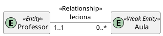

# Modelagem de dados

## Levantamento dos requisitos

### Requisitos explicitos

- cadastrar um aluno com seu nome, matricula, dados de reconhecimento.

- permitir que professores lançem a presença de alunos no histórico de aulas assistidas.

### Requisitos implicitos

- cadastrar professores com seu nome, matricula.

- criar turmas com alunos e professores

## Identificação de entidades, realcionamentos e atributos

### Entidades identificadas

- Aluno
- Professor
- Disciplina
- Turma
- Aula

### Relacionamentos identificados

- Aluno assite Aula
- Professor leciona Aula
- Aluno matriculado Turma
- Professor designado Turma
- Turma tem Aulas
- Turma estuda Disciplina

### Atributos identificados

- Aluno
  - Matricula
  - Nome
  - Sobrenome
  - Dados reconhecimento facial
- Professor
  - Matricula
  - Nome
  - Sobrenome
- Disciplina
  - Codigo
  - Nome
- Turma
  - Nome
  - Semestre
  - Ano
- Aula
  - Data
  - Hora

## Modelo E-R

```plantUml
@startuml

entity Professor <<Entity>> {
    Matricula
    Nome
}
entity Aluno <<Entity>> {
    Natricula
    Nome
    Dados_faciais : [0..3]
}
entity Disciplina <<Entity>> {
    Codigo
    Nome
}
entity Turma <<Weak Entity>> {
    Nome
    Ano
    Semestre
}
entity Aula <<Weak Entity>> {
    Data
    Hora
}

Turma -[hidden]- Aluno
Turma -[hidden]- Aula
Turma -[hidden]- Professor
Disciplina -[hidden]- Turma
hide methods
@enduml
```





-----

As entidades Aluno e Professor transformaram-se em


O relacionamento assiste, entre Aluno e Aula, transformou-se em


O relacionamento matriculado, entre Aluno e Turma, transformou-se em


-----

## Esquema Lógico-Relacional *(com possiveis correções)*

Individuo(Id: NN, Nome: NN, Sobrenome)

- Chaves = {(Id)}

Dado_Facial(Id_Individuo: NN, Dado: NN)

- Id_Individuo referencia Individuo
- Chaves = {(Id_Individuo), (Dado)}

Aluno(Id_Individuo: NN, Matricula: NN)

- Id_Individuo referencia Individuo
- Chaves = {(Id_Individuo), (Matricula)}

Professor(Id_Individuo: NN, Matricula: NN)

- Id_Individuo referencia Individuo
- Chaves = {(Id_Individuo), (Matricula)}

Disciplina(Codigo: NN, Nome: NN)

- Chaves {(Codigo)}

Turma(Id: NN, Ano: NN, Semestre: NN, Nome: NN, Id_Disciplina: NN, Id_Professor: NN)

- Id_Professor referencia Professor
- Id_Disciplina referencia Disciplina
- Chaves = {(Id_Disciplina, Ano, Semestre, Nome)}

Aula(Id: NN, Data: NN, Hora: NN, Id_Professor: NN, Id_Turma: NN)

- Id_Professor referencia Professor
- Id_Turma referencia Turma
- Chave = {(Id), (Id_Turma, Data, Hora)}

Aluno_Aula(Matricula_Aluno: NN, Id_Aula: NN)

- Matricula_Aluno referencia Aluno
- Id_Aula referencia Aula
- Chave = {(Matricula_Aluno, Id_Aula)}

Aluno_Turma(Matricula_Aluno: NN, Id_Turma: NN)

- Matricula_Aluno referencia Aluno
- Id_Turma referencia Turma

## Normalizacão *(com possiveis correções)*

Individuo(Id: NN, Nome: NN, Sobrenome)

- Chaves = {(Id)}
- Dominio(Id)        = Inteiro
- Dominio(Nome)      = Caracteres
- Dominio(Sobrenome) = Caracteres

Dado_Facial(Id_Individuo: NN, Dado: NN)

- Id_Individuo referencia Individuo
- Chaves = {(Id_Individuo, Dado)}
- Dominio(Id_Individuo) = Inteiro
- Dominio(Dado)         = Caracteres

Aluno(Id_Individuo: NN, Matricula: NN)

- Id_Individuo referencia Individuo
- Chaves = {(Id_Individuo), (Matricula)}
- Dominio(Id_Individuo) = Inteiro
- Dominio(Matricula)    = Carecteres

Professor(Id_Individuo: NN, Matricula: NN)

- Id_Individuo referencia Individuo
- Chaves = {(Id_Individuo), (Matricula)}
- Dominio(Id_Individuo) = Inteiro
- Dominio(Matricula)    = Carecteres

Disciplina(Codigo: NN, Nome: NN)

- Chaves {(Codigo)}
- Dominio(Codigo) = Caracteres
- Dominio(Nome)   = Caracteres

Turma(Id: NN, Id_Disciplina: NN, Ano: NN, Semestre: NN, Nome: NN, Matricula_Professor: NN)

- Matricula_Professor referencia Professor
- Id_Disciplina referencia Disciplina
- Chaves = {(Id), (Id_Disciplina, Ano, Semestre, Nome)}
- Dominio(Id)            = Inteiro
- Dominio(Id_Disciplina) = Inteiro
- Dominio(Ano)           = Inteiro
- Dominio(Semestre)      = Inteiro
- Dominio(Nome)          = Caracteres
- Dominio(Matricula_Professor)  = Inteiro

Aula(Id: NN, Id_Turma: NN, Data_Horario_UTC: NN, Matricula_Professor: NN)

- Id_Turma referencia Turma
- Matricula_Professor referencia Professor
- Chave = {(Id), (Id_Turma, Data_Horario_UTC)}
- Dominio(Id)                  = Inteiro
- Dominio(Id_Turma)            = Inteiro
- Dominio(Data_Horario_UTC)    = Caracteres
- Dominio(Matricula_Professor) = Inteiro

Aluno_Aula(Matricula_Aluno: NN, Id_Aula: NN)

- Matricula_Aluno referencia Aluno
- Id_Aula referencia Aula
- Chave = {(Matricula_Aluno, Id_Aula)}
- Dominio(Matricula_Aluno) = Inteiro
- Dominio(Id_Aula)         = Inteiro

Aluno_Turma(Matricula_Aluno: NN, Id_Turma: NN)

- Matricula_Aluno referencia Aluno
- Id_Turma referencia Turma
- Chave = {(Matricula_Aluno, Id_Turma)}
- Dominio(Matricula_Aluno) = Inteiro
- Dominio(Id_Turma)        = Inteiro

## Implementacao

Relações e atributos serão nomeados usando camelCase.

### DDL para uso com SQLite3 *(com possiveis correções)*

```sql
-- SQLITE3 v3.38
CREATE TABLE IF NOT EXISTS individuo (
  auto_id   INTEGER NOT NULL,
  cpf       TEXT    NOT NULL,
  nome      TEXT    NOT NULL,
  sobrenome TEXT,
  PRIMARY KEY (auto_id)
  UNIQUE (cpf)
) STRICT;

CREATE TABLE IF NOT EXISTS dadoFacial (
  idIndividuo INTEGER NOT NULL,
  dado        TEXT    NOT NULL,
  PRIMARY KEY (idIndividuo, dado),
  FOREIGN KEY (idIndividuo) REFERENCES individuo (auto_id)
) STRICT;

CREATE TABLE IF NOT EXISTS aluno (
  idIndividuo INTEGER NOT NULL,
  matricula   TEXT    NOT NULL,
  PRIMARY KEY (matricula),
  UNIQUE      (idIndividuo),
  FOREIGN KEY (idIndividuo) REFERENCES individuo (auto_id)
) STRICT;

CREATE TABLE IF NOT EXISTS professor (
  idIndividuo INTEGER NOT NULL,
  matricula   TEXT    NOT NULL,
  PRIMARY KEY (matricula),
  UNIQUE      (idIndividuo),
  FOREIGN KEY (idIndividuo) REFERENCES individuo (auto_id)
) STRICT;

CREATE TABLE IF NOT EXISTS disciplina (
  codigo TEXT NOT NULL,
  nome   TEXT NOT NULL,
  PRIMARY KEY (codigo)
) STRICT;

CREATE TABLE IF NOT EXISTS turma (
  auto_id            INTEGER NOT NULL,
  codigoDisciplina   TEXT    NOT NULL,
  ano                INTEGER NOT NULL,
  semestre           INTEGER NOT NULL,
  nome               TEXT    NOT NULL,
  matriculaProfessor TEXT    NOT NULL,
  PRIMARY KEY (auto_id),
  UNIQUE      (codigoDisciplina, ano, semestre, nome),
  FOREIGN KEY (codigoDisciplina)       REFERENCES disciplina (codigo),
  FOREIGN KEY (matriculaProfessor) REFERENCES professsor (matricula)
) STRICT;

CREATE TABLE IF NOT EXISTS aula (
  auto_id            INTEGER NOT NULL,
  idTurma            INTEGER NOT NULL,
  dataHorarioUtc     TEXT    NOT NULL,
  matriculaProfessor TEXT    NOT NULL,
  PRIMARY KEY (auto_id),
  UNIQUE      (idTurma, dataHorarioUtc),
  FOREIGN KEY (idTurma)            REFERENCES turma (auto_id),
  FOREIGN KEY (matriculaProfessor) REFERENCES professor (matricula)
) STRICT;

CREATE TABLE IF NOT EXISTS alunoAula (
  matriculaAluno TEXT    NOT NULL,
  idAula         INTEGER NOT NULL,
  PRIMARY KEY (matriculaAluno, idAula),
  FOREIGN KEY (matriculaAluno) REFERENCES aluno (matricula),
  FOREIGN KEY (idAula)         REFERENCES aula (auto_id)
) STRICT;

CREATE TABLE IF NOT EXISTS alunoTurma (
  matriculaAluno TEXT    NOT NULL,
  idTurma        INTEGER NOT NULL,
  PRIMARY KEY (matriculaAluno, idTurma),
  FOREIGN KEY (matriculaAluno) REFERENCES aluno (matricula),
  FOREIGN KEY (idTurma) REFERENCES turma (auto_id)
) STRICT;
```

## Testes Basicos

```sql
-- inserir 4 alunos com nome e sobrenome e 2 professores com nome
INSERT INTO individuo (cpf, nome, sobrenome) VALUES
  ('22233344401', 'john', 'aaa'),
  ('22233355501', 'john', 'bbb'),
  ('22233366601', 'jane', 'aaa'),
  ('22233377701', 'jane', 'bbb');
INSERT INTO individuo (cpf, nome) VALUES
  ('33344422201', 'john'),
  ('33344433301', 'jane');
INSERT INTO aluno (idIndividuo, matricula) VALUES
  (1, 'matricula_aluno_1'),
  (2, 'matricula_aluno_2'),
  (3, 'matricula_aluno_3'),
  (4, 'matricula_aluno_4');
INSERT INTO professor (idIndividuo, matricula) VALUES
  (5, 'matricula_professor_1'),
  (6, 'matricula_professor_2');

-- inserir 2 dados faciais, 1 para aluno e 1 para professor
INSERT INTO dadoFacial (idIndividuo, dado) VALUES
  (3, 'dado_facial_1_aluno_3'),
  (3, 'dado_facial_2_aluno_3'),
  (3, 'dado_facial_3_aluno_3'),
  (6, 'dado_facial_1_professor_2');

-- inserir 3 disciplinas
INSERT INTO disciplina (codigo, nome) VALUES
  ('codigo_disciplina_1', 'nome da disciplina 1'),
  ('codigo_disciplina_2', 'nome da disciplina 2'),
  ('codigo_disciplina_3', 'nome da disciplina 3');

-- inserir 5 turmas
INSERT INTO turma (codigoDisciplina, ano, semestre, nome, matriculaProfessor) VALUES
  ('codigo_disciplina_1', 2024, 1, 'nome turma 1', 'matricula_professor_1'),
  ('codigo_disciplina_2', 2024, 1, 'nome turma 1', 'matricula_professor_2'),
  ('codigo_disciplina_3', 2024, 1, 'nome turma 1', 'matricula_professor_1'),
  ('codigo_disciplina_1', 2024, 1, 'nome turma 2', 'matricula_professor_2'),
  ('codigo_disciplina_2', 2024, 1, 'nome turma 2', 'matricula_professor_1');

-- inserir 3 aulas
-- formato para dataHorarioUtc: YYYY-MM-DD HH:MM
INSERT INTO aula (idTurma, matriculaProfessor, dataHorarioUtc) VALUES
  (1, 'matricula_professor_1', strftime('%F %R', 'now')),
  (1, 'matricula_professor_1', strftime('%F %R', 'now', '+1 day')),
  (2, 'matricula_professor_2', strftime('%F %R', 'now', '+2 days'));

-- inserir os 4 alunos em 3 turmas
INSERT INTO alunoTurma (matriculaAluno, idTurma) VALUES
  ('matricula_aluno_1', 1),
  ('matricula_aluno_2', 1),
  ('matricula_aluno_3', 1),
  ('matricula_aluno_4', 1),
  ('matricula_aluno_1', 2),
  ('matricula_aluno_2', 2),
  ('matricula_aluno_3', 2),
  ('matricula_aluno_4', 2),
  ('matricula_aluno_1', 3),
  ('matricula_aluno_2', 3),
  ('matricula_aluno_3', 3),
  ('matricula_aluno_4', 3);

-- inserir a presenca nas 3 aulas criadas
INSERT INTO alunoAula (matriculaAluno, idAula) VALUES
  ('matricula_aluno_1', 1),
  ('matricula_aluno_4', 1),
  ('matricula_aluno_1', 2),
  ('matricula_aluno_2', 2),
  ('matricula_aluno_4', 2),
  ('matricula_aluno_1', 3),
  ('matricula_aluno_2', 3),
  ('matricula_aluno_3', 3),
  ('matricula_aluno_4', 4);

-- selecionar todos os alunos
SELECT * FROM aluno;

-- selecionar todas as aulas de todas as turma de um dado ano e semestre
SELECT * FROM aula JOIN turma ON aula.idTurma = turma.auto_id WHERE ano = 2024 AND semestre = 1;

-- selecionar os dados faciais de todos os alunos que participam da turma especificada
-- turma 1: 'codigo_disciplina_1', 2024, 1, 'nome turma 1'
SELECT a.matricula, df.dado
  FROM alunoTurma at
  JOIN turma t
  ON t.auto_id = at.idTurma
  JOIN aluno a
  ON a.matricula = at.matriculaAluno
  JOIN dadoFacial df
  ON df.idIndividuo = a.idIndividuo
  WHERE t.codigoDisciplina = 'codigo_disciplina_1' AND t.ano = 2024 AND t.semestre = 1 AND t.nome = 'nome turma 1';
-- turma 2: 'codigo_disciplina_2', 2024, 1, 'nome turma 1'
SELECT a.matricula, df.dado
  FROM alunoTurma at
  JOIN turma t
  ON t.auto_id = at.idTurma
  JOIN aluno a
  ON a.matricula = at.matriculaAluno
  JOIN dadoFacial df
  ON df.idIndividuo = a.idIndividuo
  WHERE t.codigoDisciplina = 'codigo_disciplina_2' AND t.ano = 2024 AND t.semestre = 1 AND t.nome = 'nome turma 1';
```
